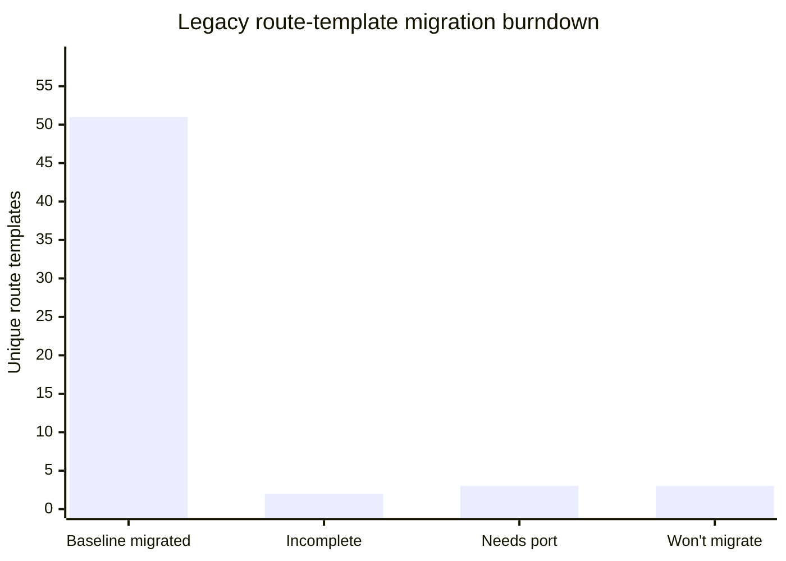

# Migrating pages from the legacy AngularJS app

This document is the playbook for porting a page/feature from the legacy AngularJS frontend
(`seed/static/seed/` in the main [`seed`](https://github.com/SEED-platform/seed) repo) into this
Angular app, plus a tracked checklist of what's left.

For general coding conventions of *this* app, see `DEVELOPER.md` and `.github/copilot-instructions.md`.
This document covers the page/route-level migration process; once you're inside a page and
building the actual form, see `docs/porting-forms.md` for the form-specific recipe (canonical
components, validation/save flow, Transloco + Lokalise workflow).

## Why two frontends exist right now

SEED is mid-migration from an AngularJS 1.x SPA to this Angular app. Both currently run side by
side, served by the same Django backend (`config/urls.py` in the main repo):

- **Legacy app** — AngularJS 1.x, served under `/app/` (`seed.urls`). Source lives in the main
  `seed` repo at `seed/static/seed/`:
  - `js/seed.js` — the `$stateProvider` route table (the authoritative list of every legacy page,
    its URL, its `templateUrl`, and its controller).
  - `js/controllers/<name>_controller.js` — one controller per page or modal.
  - `js/services/`, `js/directives/`, `js/filters/` — shared AngularJS services/directives/filters.
  - `partials/<name>.html` — the AngularJS templates (`ng-repeat`, `ui-sref`, `{$:: ... $}`
    interpolation, etc.).
  - `locales/<lang>.json` — legacy translation strings, keyed by the English source string.
- **This app** — served under `/ng-app/` as a static SPA (`ng_seed/views.py::seed_angular` serves
  `index.html` for any non-file `/ng-app/*` request). This repo (`ng_seed/seed-angular`) is a **git
  submodule** of the main `seed` repo — it has its own git history/remote, separate from the
  Django backend.

There is currently no in-app link from the legacy UI to the new one (or vice versa) for
already-migrated pages — cutover/navigation strategy is decided outside this repo. Don't assume a
page is "live" for users just because it exists here; check with the team before removing/altering
the legacy route for something you just migrated.

## Playbook: porting one page

1. **Find the legacy route.** Search `seed/static/seed/js/seed.js` for the `.state({ name: '...' })`
   block for the page (or grep the URL/partial name). Note its `url`, `templateUrl`, `controller`,
   and any `resolve` block (these usually prefetch data via services — they typically become either
   an Angular route `resolve` or a plain `ngOnInit`/service call in the new component).
2. **Read the legacy controller + partial.** `js/controllers/<name>_controller.js` and
   `partials/<name>.html`. Also check for companion **modal** controllers/partials
   (`<name>_modal_controller.js` + `<name>_modal.html`) used by the page — these become
   `MatDialog`-based standalone components under a local `modal/` folder, mirroring existing
   examples like `modules/organizations/cycles/modal/`.
3. **Find or create the API service.** Identify the backend endpoints the controller calls
   (`$http`/Restangular calls to `/api/v3/...`). Check whether a matching service already exists
   under `src/@seed/api/<resource>/` — most resources already have one (`organization`, `cycle`,
   `property`, `column`, `pairing`, `salesforce`, etc.). If not, add `<resource>.service.ts` +
   `<resource>.types.ts` following the existing pattern: `@Injectable({ providedIn: 'root' })`,
   `inject(HttpClient)`, private `ReplaySubject`/`BehaviorSubject` state with a public `<name>$`
   observable. **Call the same `/api/v3/...` endpoint the legacy controller already uses** — a
   migration should not require backend changes. Only reach for a new `/api/v4/...` endpoint (in
   the main `seed` repo's `seed/api/v4/`) if the page genuinely needs backend behavior that has no
   v3 endpoint at all; that's a backend change coordinated separately, not something to add
   speculatively while porting a page.
4. **Build the new page** as standalone component(s) under `src/app/modules/<feature>/...`, and
   wire it into that feature's `<feature>.routes.ts` (default-exported `Routes` array), following
   the URL shape of sibling routes already migrated in the same feature area (paths have often been
   reshaped to kebab-case, e.g. legacy `inventory_cycles` → new `cross-cycles`, legacy
   `insights_program` → new `program-overview`; match existing renamed siblings rather than the
   legacy URL literally).
5. **Convert the template.** Common substitutions:
   | Legacy (AngularJS) | New (Angular) |
   |---|---|
   | `ng-repeat="x in items"` | `@for (x of items; track x.id)` |
   | `ng-if` / `ng-show` / `ng-hide` | `@if` |
   | `ui-sref="stateName"` | `routerLink="/path"` |
   | `{$:: 'Text' $}` / `translate` filter/directive | `{{ 'Text' \| transloco }}` |
   | `ng-model` two-way binding | Reactive forms (`FormControl`/`FormGroup`) |
   | `$scope.x` | component class field |
   | Bootstrap classes, custom CSS | Tailwind utility classes (mobile-first, light+dark theme) |
   | AngularJS service (`js/services/*.js`) | injectable Angular service, `providedIn: 'root'` |
6. **Reuse translations, don't retranslate.** Both apps use the same flat
   `{ "English string": "translated string" }` JSON format, with matching keys in
   `seed/static/seed/locales/<lang>.json` (legacy) and `public/i18n/<lang>.json` (this app). Copy
   the existing key/value pairs for the strings you're porting instead of re-authoring them; only
   run `pnpm update-translations` / involve Lokalise for genuinely new strings.
7. **Follow this repo's conventions** (standalone components with an `imports` array, `inject()`
   for DI, `_`-prefixed private fields, `$`-suffixed observables, `MaterialImports` barrel,
   `takeUntil(this._unsubscribeAll$)` cleanup) — see `DEVELOPER.md` for the full list.
8. **Validate.** Run `pnpm lint` and `pnpm build` — but they only catch type/compile errors, not
   runtime bugs. Also actually load the page against a live backend with real seeded data and
   click through the behavior you ported (not just render it) using Playwright before considering
   the port done — see [`docs/local-testing.md`](docs/local-testing.md) for how to stand up a
   throwaway backend + test data in this environment. Skipping this step is how a migration ships
   with, e.g., a drag-and-drop that silently no-ops or a tab switch that updates the URL but not
   the page.
9. **Do not delete or edit the legacy AngularJS code** as part of a migration PR unless explicitly
   asked to — the legacy route keeps serving production traffic under `/app/` until a separate
   decision is made to retire it.

## Full frontend parity crosswalk

The route checklist below is necessary but not sufficient. A migration is only complete when the
new Angular page accounts for the entire legacy frontend surface: rendered HTML, conditional and
repeated content, controller behavior, directives and filters, modals, permissions, navigation,
API calls and payloads, translations, empty/loading/error states, and real-data interactions.

The table is deliberately source-oriented. `Status key` and `Page key` are stable sort keys: the
rows are currently sorted by status, then page key, so the table remains easy to sort in an editor
or spreadsheet. GitHub-flavored Markdown does not provide interactive column sorting; do not add
JavaScript to this Markdown file because GitHub strips it. The generated repo dashboard provides
the visual view, while this table is the reviewable source of truth.

### How to use the table

For each row, compare every legacy file in the “Legacy HTML and behavior” and “Legacy dependencies”
columns with the Angular files in “New Angular implementation.” Mark a page `DONE` only when the
completion gate is satisfied. A matching URL or component file alone is `INCOMPLETE`, not done.

| Status key | Page key | Legacy HTML and behavior | Legacy dependencies | New Angular implementation | Completion gate / current evidence |
|---|---|---|---|---|---|
| `01-NEEDS_PORT` | `personal-two-factor` | `seed.js` state `two_factor_profile` → `seed/static/seed/partials/two_factor_profile.html` → `seed/static/seed/js/controllers/two_factor_profile_controller.js`; inspect all `ng-if`, token/QR states, validation, and modal behavior. | `seed/static/seed/js/services/two_factor_service.js` (`set_method`, `resend_token_email`, `generate_qr_code`, `verify_code`) → `/api/v3/two_factor/*`. | No personal enrollment page yet. Do not confuse this with the migrated organization policy page at `src/app/modules/organizations/settings/two-factor/`. | Port the full enrollment flow, preserve v3 behavior, copy translations, test QR/email/code failure states with seeded data, then move to `DONE`. |
| `01-NEEDS_PORT` | `organization-sharing` | `seed.js` state `organization_sharing` → `seed/static/seed/partials/organization_sharing.html` → `seed/static/seed/js/controllers/organization_sharing_controller.js`; inspect column selection, threshold controls, visibility rules, and save feedback. | Trace every `$http`/Restangular call from the controller and related organization/analysis services; record endpoint, query params, request body, and permissions here before coding. | No parity route found in `src/app/modules/organizations/settings/`. | Add a standalone Angular settings page, typed API integration, translations, navigation entry, permission behavior, and a real-data save/reload test. |
| `01-NEEDS_PORT` | `program-setup` | `seed.js` states `programs` and `program_setup` → `seed/static/seed/partials/program_setup.html` → `seed/static/seed/js/controllers/program_setup_controller.js`; inspect CRUD form, valid data types, compliance metrics, modal states, and validation. | Trace the controller’s compliance metric/program calls and any `organization_service` calls; distinguish this full org CRUD page from the smaller embedded program picker. | `src/app/modules/insights/config/program-config.component.ts` is only the embedded picker and is not parity for this page. | Build full org-level program CRUD under organization settings, including create/edit/delete, validation, permissions, translations, and Playwright coverage. |
| `02-INCOMPLETE` | `salesforce-login` | `seed.js` state `salesforce_login` → `seed/static/seed/partials/salesforce_login.html` → `seed/static/seed/js/controllers/salesforce_login_controller.js`; inspect OAuth success, failure, redirect, and organization resolve behavior. | Trace `salesforce_service`/`user_service` calls and callback parameters; verify backend callback route and error payloads. | `src/app/modules/salesforce-login/salesforce-login.component.ts/.html` exists on PR #56’s branch, not current Angular `main`. | Complete callback success/failure testing, translations, navigation/cutover decision, and checklist update after merge. |
| `02-INCOMPLETE` | `portfolio-summary` | `seed.js` state `portfolio_summary` → legacy portfolio-summary partial/controller plus every goal/cycle/partner modal partial it opens; compare loading, empty, chart, goal, cycle, and approval states. | Trace legacy goal, cycle, Salesforce portfolio, organization, column, and permission services; verify payloads and partner-approval ownership. | `src/app/modules/insights/portfolio-summary/portfolio-summary.component.html/.ts`, `add-cycle-dialog/`, `configure-goals-dialog/`, `src/@seed/api/goal/`, and `src/@seed/api/salesforce-portfolio/`. | PR #56 is explicitly in progress. Verify all rendered HTML, dialogs, charts, translations, API saves, permissions, and real seeded-data interactions before calling the enhancement done. |
| `03-DONE_BASELINE` | `facilities-plan` | Legacy `facilities_plan` state → `seed/static/seed/partials/facilities_plan.html` → `facilities_plan_controller.js`; include create/edit/delete/export controls, plan-run selection, grid, and modal partials. | `facilities_plan_service.js`, `facilities_plan_run_service.js`, `service_service.js`, and `system_service.js`; preserve facilities-plan and plan-run v3 endpoints. | `src/app/modules/insights/facilities-plan/facilities-plan.component.html/.ts`, local `modal/` components, and `src/@seed/api/facilities-plan*/`. | Current remote `main` lists this as migrated. Confirm full HTML and behavior audit, lint/build, and Playwright evidence; the local branch’s older checklist is stale. |
| `03-DONE_BASELINE` | `pairing-workflow` | Legacy `pairing` state → `seed/static/seed/partials/pairing.html` → `pairing_controller.js`; include dual grids, drag/drop, filters, matching, unmatching, and error states. | `pairing_service.js` and its property/taxlot pair/unpair endpoints. | `src/app/modules/datasets/pairing/pairing.component.html/.ts` and `src/@seed/api/pairing/pairing.service.ts`. | Current remote `main` lists it as migrated. Verify drag/drop and save behavior against real data; pairing settings are intentionally separate and superseded. |
| `03-DONE_BASELINE` | `organization-settings` | Legacy `organization_*` states and partials/controllers for settings, access levels, columns, mappings, data quality, cycles, labels, members, email templates, and derived columns. | Organization, column, cycle, label, data-quality, goal, and derived-column services; include permission guards and modal flows. | `src/app/modules/organizations/` feature routes/components and matching `src/@seed/api/` services. | Current remote `main` lists the family as migrated. Audit each child page’s HTML, modal, validation, translation, permission, and save/delete behavior rather than treating the family as one completed page. |
| `03-DONE_BASELINE` | `inventory-family` | Legacy `inventory_*`, `inventory_detail_*`, and `inventory_group_*` states, partials, controllers, directives, tabs, grids, maps, notes, meters, sensors, timeline, UBIDs, and column-detail profiles. | Inventory, property, taxlot, group, meter, sensor, cycle, map, and column services; record all filters, pagination, exports, and bulk actions. | `src/app/modules/inventory/`, `inventory-list/`, `inventory-detail/`, groups, maps, and related `src/@seed/api/` services. | Current remote `main` lists the family as migrated. Audit every tab and interactive grid with real data, including mobile/dark styling and no-data/error states. |
| `03-DONE_BASELINE` | `insights-reporting` | Legacy `insights_program`, `insights_property`, `reports`, `custom_reports`, `data_view`, and `portfolio_summary` states plus their partials/controllers/modals. | Program, report, property-measure, goal, cycle, Salesforce, and organization services; include chart configuration, downloads, and report filters. | `src/app/modules/insights/`, `analyses/`, default reports, data view, and portfolio-summary components/API services. | Current remote `main` has corresponding routes/components. Portfolio-summary enhancement remains `INCOMPLETE` until PR #56’s expanded behavior is reviewed and verified. |
| `03-DONE_BASELINE` | `core-pages` | Legacy `home`, `profile`, `security`, `developer`, `admin`, `analyses`, `mapping`, `dataset_list`, `dataset_detail`, `about`, `contact`, and `api_docs` partials/controllers. | Auth, user, organization, dataset, analysis, navigation, translation, and shared modal services. | `src/app/modules/main/`, `profile/`, `analyses/`, `datasets/`, and app-level routing/navigation. | Current remote `main` lists these as migrated. Confirm page-level HTML and behavior parity, not just route coverage. |
| `04-WONT_MIGRATE` | `pairing-settings` | Legacy `pairing_settings` state → pairing-settings partial/controller and localStorage-backed column configuration. | Pairing settings controller/service and localStorage profile behavior. | No standalone page by design; pairing reuses the Angular List View Profile selector. | Keep superseded rationale. Do not create a second column-configuration system unless the product decision changes. |
| `04-WONT_MIGRATE` | `inventory-plots` | Legacy `inventory_plots` state → `seed/static/seed/partials/inventory_plots.html` → `inventory_plots_controller.js`; fixed chart view was unlinked/unused. | Inventory/cycle/profile services used by the old chart page. | No new route by design; Insights covers the supported analytical use case. | Keep as explicitly superseded, not an accidental migration gap. |
| `04-WONT_MIGRATE` | `sub-organizations` | Legacy `organization_sub_orgs` state → `seed/static/seed/partials/sub_org.html` → `organization_controller.js` plus create-sub-org modal. | `organization_service.create_sub_org` and related organization permissions. | No new route by design; access-level-tree is the supported model. | Keep as explicitly superseded by access levels. |

### Full-page parity checklist

Use this checklist for every `03-DONE_BASELINE` page before calling it truly complete:

- **Rendered HTML:** every legacy partial and companion modal has a new template or an explicit
  documented replacement; inspect tables, forms, tabs, charts, empty states, loading states, and
  error states.
- **Behavior:** every controller handler, watcher, debounce, selection, drag/drop action, bulk
  action, save/delete flow, redirect, and confirmation has an Angular equivalent or documented
  product decision.
- **Shared frontend mechanics:** directives, filters, interpolation, permissions, navigation,
  breadcrumbs, menus, feature flags, responsive layout, light/dark theme, and keyboard behavior
  are accounted for.
- **API parity:** every legacy service call maps to a typed Angular API service with the same v3
  endpoint, query parameters, payload semantics, response mapping, and error behavior unless a
  backend change is explicitly documented.
- **Translations:** every user-facing string is present in `public/i18n/` and reuses the legacy
  translation key/value where applicable.
- **Validation:** `pnpm lint` and `pnpm build` pass; the page is loaded against a live backend with
  seeded data; important interactions are clicked through with Playwright; screenshots or other
  review evidence are attached to the migration PR.
- **Cutover:** the legacy route remains intact unless a separate product decision authorizes its
  retirement; “ported” does not mean “live for users.”

## Migration burndown

Snapshot based on the current legacy route table and HTML inventory:

- **166** legacy partial HTML files exist under `seed/static/seed/partials/`.
- **59** are unique route-owned templates referenced by `seed/static/seed/js/seed.js`.
- **107** are shared fragments, navigation/header files, dynamic includes, or modal HTML. These
  are not separate pages; they are audited under the page family that opens or includes them.
- **86** legacy files have `modal` in their filename. Modal parity is part of the parent page’s
  completion gate.
- Angular currently has **200** application HTML templates under `src/app/` plus **32** shared
  framework templates under `src/@seed/`.

The route-owned burndown is the primary progress metric because it avoids inflating the denominator
with reusable modal and fragment files:

| Burndown status | Route-owned templates | Share | Meaning |
|---|---:|---:|---|
| Baseline migrated | 51 | 86.4% | Angular route/component exists on the current baseline; full HTML/behavior sign-off may still be outstanding. |
| Ported but incomplete | 2 | 3.4% | Salesforce login exists on PR #56’s branch; Portfolio Summary has an in-progress enhancement in PR #56. |
| Needs port | 3 | 5.1% | Personal two-factor, Organization Sharing, and full Program Setup. |
| Won’t migrate | 3 | 5.1% | Pairing settings, Inventory Plots, and Sub-organizations are explicitly superseded. |
| **Total** | **59** | **100%** | Unique route-owned legacy templates. |

That leaves **5 active route templates** to finish or port: 2 incomplete plus 3 needing a port.
That is **8.5% of all route-owned templates**, or **8.9% of the 56 templates that are intended to
have an Angular implementation**.

### Next page recommendation

Port **Personal two-factor setup** next. It is the smallest genuine gap and has a bounded,
well-defined source surface:

- Legacy HTML: `two_factor_profile.html` and `qr_code_scan_modal.html`.
- Legacy behavior: `two_factor_profile_controller.js` and `qr_code_scan_modal_controller.js`.
- Legacy API: `two_factor_service.js` using `/api/v3/two_factor/set_method/`,
  `/resend_token_email/`, `/generate_qr_code/`, and `/verify_code/`.
- Angular starting point: the existing profile feature routes plus the organization two-factor
  implementation at `src/app/modules/organizations/settings/two-factor/`.

This page is a good next migration because it can reuse established Angular profile, organization,
Material dialog, translation, and API-service patterns without requiring a speculative backend
change. The required parity test is the complete disabled/email/token flow, including QR generation,
verification failure, alternate-method fallback, organization-enforced 2FA, save/reload, and error
states.

## Migration status

Checklist derived from every `.state()` entry in `seed/static/seed/js/seed.js` (63 total), compared
against this app's route files. Update this table as pages move between columns.

### Not yet migrated

- [ ] **Personal two-factor setup** (`/profile/two_factor_profile`, `two_factor_profile_controller`)
      — user's own 2FA device enrollment. (Org-level two-factor *policy* settings are already
      migrated to `organizations/settings/two-factor`; this is the separate personal setup flow.)
- [ ] **Organization sharing** (`/accounts/:organization_id/sharing`, `organization_sharing_controller`)
      — org-settings tab that selects which property columns are publicly exposed in the
      organization's public data feed, and sets the public query threshold. (This is about public
      column exposure, not sub-organizations.)
- [ ] **Program setup** (`/accounts/:organization_id/program_setup[/:id]`, `program_setup_controller`)
      — BuildingSync/program configuration for an org, under org settings. (Don't confuse with
      `ProgramConfigComponent` in `insights/config/` — that's a smaller compliance-metric picker
      embedded in the already-migrated `program-overview`/`property-insights` pages, not the
      full org-level program CRUD admin page.)

### Cross-checked against legacy `js/services/`

The checklist above is built from `seed.js`'s route table, so it only catches gaps at the
page/route level. As a second pass, every legacy `js/services/<name>_service.js` (the AngularJS
service layer, ~50 files) was cross-checked against this app's `src/@seed/api/` and existing pages
to look for whole features hiding *inside* an already-migrated page rather than behind their own
route. Notes from that pass:

- **No additional missing pages found.** Everything reachable from a controller maps to either an
  already-migrated page (`goal_service`→`data-quality/goal`, `two_factor_service`→personal 2FA
  above, `compliance_metric_service`→`insights/config/program-config.component.ts`,
  `map_service`'s EEEJ/disadvantaged-tract filter→`inventory-list/map/map.component.ts`,
  `property_measure_service`→`inventory-detail/detail` scenarios grid, `pairing_service`→Pairing
  workflow, `facilities_plan_service`/`facilities_plan_run_service`/`service_service`/
  `system_service`→the now-migrated Facilities Plan page) or a page already on the list above.
- **Dead/unused in the legacy app** — not referenced by any legacy controller, so don't bother
  porting them: `element_service`, `uniformat_service`, `event_service`.
- **Cross-cutting utilities, not features** — no dedicated page to port, these are legacy
  plumbing (`modified_service` "stale record" banner, `search_service`, `http_serializer`,
  `main_service`, `simple_modal_service`, `flippers`). If similar behavior is needed while porting
  a page, it's fine to build it inline rather than looking for a 1:1 legacy service to copy.

### Won't migrate

- **Pairing settings** (`/data/pairing/:importfile_id/{type}/settings`,
  `pairing_settings_controller`) — the standalone column order/visibility page for the pairing
  grids, backed by its own `localStorage` config. Superseded: the ported `pairing` workflow
  (`modules/datasets/pairing/pairing.component.ts`) reuses the existing List View Profile column
  selector already used by the Properties/Tax Lots list pages instead of building a second,
  parallel column-config mechanism for one page.
- **Inventory plots** (`/{properties|taxlots}/plots`, `inventory_plots_controller`) — a charting
  view over inventory data. Superseded: it was unlinked and effectively unused in the legacy UI (a
  fixed 2×2 grid of hardcoded scatter plots — Year Built vs ECI, CO₂ vs GFA, BETTER Savings vs ECI,
  and CO₂/sqft vs Year Built); the Insights module now covers this need.
- **Sub-organizations** (`/accounts/:organization_id/sub_org`, `organization_controller`) —
  create/manage child organizations. Superseded: the project is standardizing on access levels (the
  already-migrated `access-level-tree`) instead of sub-orgs.

### Already migrated (for reference — don't re-port these)

Everything else in `seed.js`'s state table has a corresponding route in this app, including:
`home`→dashboard, `profile`/`security`/`developer`/`admin`→`profile/*`, `analyses`/`analysis`/
`analysis_run`→`analyses/*`, `mapping`/`dataset_list`/`dataset_detail`→`datasets/*`,
`pairing`→`datasets/pairing/:id/:type`, `about`/
`contact`/`api_docs`, the full `organization_*` settings family (settings, access-level-tree,
column settings/mappings, data-quality incl. goals, cycles, labels, members, email-templates,
derived-columns — the derived column *editor* is now a modal rather than its own route), and the
full `inventory_*`/`inventory_detail_*`/`inventory_group_*` family (list, map, summary,
cross-cycles, groups incl. dashboard/meters/systems, detail incl. analyses/meters/sensors/timeline/
notes/ubids/column-detail-profiles), and `insights_program`/`insights_property`/`reports`
(→ default-reports)/`custom_reports`/`data_view`/`portfolio_summary`, and `facilities_plan`
(→ `insights/facilities-plan` plus the org-settings facilities-plan page). The portfolio-summary
enhancement remains tracked as `INCOMPLETE` in the parity crosswalk until PR #56 is reviewed and
its full HTML/behavior checklist is complete.

If you migrate something from the "not yet migrated" list, move its line into this section (or
just delete the line) in the same PR. If the team instead decides *not* to port something, move
its line to "Won't migrate" with a reason instead.
