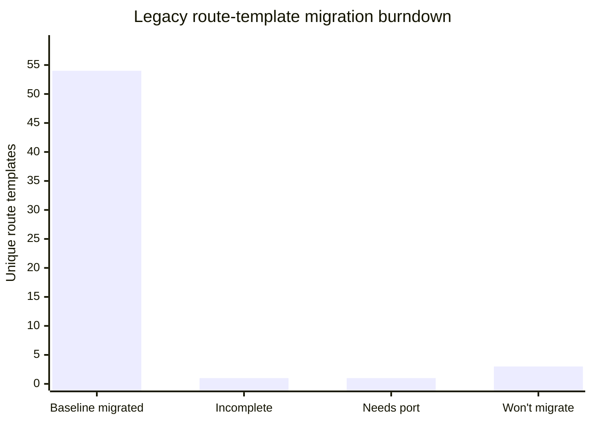

# Migrating pages from the legacy AngularJS app

This document is the playbook for porting a page/feature from the legacy AngularJS frontend
(`seed/static/seed/` in the main [`seed`](https://github.com/SEED-platform/seed) repo) into this
Angular app, plus a tracked checklist of what's left.

For general coding conventions of *this* app, see `DEVELOPER.md` and `.github/copilot-instructions.md`.
This document covers the page/route-level migration process; once you're inside a page and
building the actual form, see `docs/porting-forms.md` for the form-specific recipe (canonical
components, validation/save flow, Transloco + Lokalise workflow).

## Why two frontends exist right now

SEED is mid-migration from an AngularJS 1.x SPA to this Angular app. Both currently run side by
side, served by the same Django backend (`config/urls.py` in the main repo):

- **Legacy app** — AngularJS 1.x, served under `/app/` (`seed.urls`). Source lives in the main
  `seed` repo at `seed/static/seed/`:
  - `js/seed.js` — the `$stateProvider` route table (the authoritative list of every legacy page,
    its URL, its `templateUrl`, and its controller).
  - `js/controllers/<name>_controller.js` — one controller per page or modal.
  - `js/services/`, `js/directives/`, `js/filters/` — shared AngularJS services/directives/filters.
  - `partials/<name>.html` — the AngularJS templates (`ng-repeat`, `ui-sref`, `{$:: ... $}`
    interpolation, etc.).
  - `locales/<lang>.json` — legacy translation strings, keyed by the English source string.
- **This app** — served under `/ng-app/` as a static SPA (`ng_seed/views.py::seed_angular` serves
  `index.html` for any non-file `/ng-app/*` request). This repo (`ng_seed/seed-angular`) is a **git
  submodule** of the main `seed` repo — it has its own git history/remote, separate from the
  Django backend.

There is currently no in-app link from the legacy UI to the new one (or vice versa) for
already-migrated pages — cutover/navigation strategy is decided outside this repo. Don't assume a
page is "live" for users just because it exists here; check with the team before removing/altering
the legacy route for something you just migrated.

## Playbook: porting one page

1. **Find the legacy route.** Search `seed/static/seed/js/seed.js` for the `.state({ name: '...' })`
   block for the page (or grep the URL/partial name). Note its `url`, `templateUrl`, `controller`,
   and any `resolve` block (these usually prefetch data via services — they typically become either
   an Angular route `resolve` or a plain `ngOnInit`/service call in the new component).
2. **Read the legacy controller + partial.** `js/controllers/<name>_controller.js` and
   `partials/<name>.html`. Also check for companion **modal** controllers/partials
   (`<name>_modal_controller.js` + `<name>_modal.html`) used by the page — these become
   `MatDialog`-based standalone components under a local `modal/` folder, mirroring existing
   examples like `modules/organizations/cycles/modal/`.
3. **Find or create the API service.** Identify the backend endpoints the controller calls
   (`$http`/Restangular calls to `/api/v3/...`). Check whether a matching service already exists
   under `src/@seed/api/<resource>/` — most resources already have one (`organization`, `cycle`,
   `property`, `column`, `pairing`, `salesforce`, etc.). If not, add `<resource>.service.ts` +
   `<resource>.types.ts` following the existing pattern: `@Injectable({ providedIn: 'root' })`,
   `inject(HttpClient)`, private `ReplaySubject`/`BehaviorSubject` state with a public `<name>$`
   observable. **Call the same `/api/v3/...` endpoint the legacy controller already uses** — a
   migration should not require backend changes. Only reach for a new `/api/v4/...` endpoint (in
   the main `seed` repo's `seed/api/v4/`) if the page genuinely needs backend behavior that has no
   v3 endpoint at all; that's a backend change coordinated separately, not something to add
   speculatively while porting a page.
4. **Build the new page** as standalone component(s) under `src/app/modules/<feature>/...`, and
   wire it into that feature's `<feature>.routes.ts` (default-exported `Routes` array), following
   the URL shape of sibling routes already migrated in the same feature area (paths have often been
   reshaped to kebab-case, e.g. legacy `inventory_cycles` → new `cross-cycles`, legacy
   `insights_program` → new `program-overview`; match existing renamed siblings rather than the
   legacy URL literally).
5. **Convert the template.** Common substitutions:
   | Legacy (AngularJS) | New (Angular) |
   |---|---|
   | `ng-repeat="x in items"` | `@for (x of items; track x.id)` |
   | `ng-if` / `ng-show` / `ng-hide` | `@if` |
   | `ui-sref="stateName"` | `routerLink="/path"` |
   | `{$:: 'Text' $}` / `translate` filter/directive | `{{ 'Text' \| transloco }}` |
   | `ng-model` two-way binding | Reactive forms (`FormControl`/`FormGroup`) |
   | `$scope.x` | component class field |
   | Bootstrap classes, custom CSS | Tailwind utility classes (mobile-first, light+dark theme) |
   | AngularJS service (`js/services/*.js`) | injectable Angular service, `providedIn: 'root'` |
6. **Reuse translations, don't retranslate.** Both apps use the same flat
   `{ "English string": "translated string" }` JSON format, with matching keys in
   `seed/static/seed/locales/<lang>.json` (legacy) and `public/i18n/<lang>.json` (this app). Copy
   the existing key/value pairs for the strings you're porting instead of re-authoring them; only
   run `pnpm update-translations` / involve Lokalise for genuinely new strings.
7. **Follow this repo's conventions** (standalone components with an `imports` array, `inject()`
   for DI, `_`-prefixed private fields, `$`-suffixed observables, `MaterialImports` barrel,
   `takeUntil(this._unsubscribeAll$)` cleanup) — see `DEVELOPER.md` for the full list.
8. **Validate.** Run `pnpm lint` and `pnpm build` — but they only catch type/compile errors, not
   runtime bugs. Also actually load the page against a live backend with real seeded data and
   click through the behavior you ported (not just render it) using Playwright before considering
   the port done — see [`docs/local-testing.md`](docs/local-testing.md) for how to stand up a
   throwaway backend + test data in this environment. Skipping this step is how a migration ships
   with, e.g., a drag-and-drop that silently no-ops or a tab switch that updates the URL but not
   the page.
9. **Do not delete or edit the legacy AngularJS code** as part of a migration PR unless explicitly
   asked to — the legacy route keeps serving production traffic under `/app/` until a separate
   decision is made to retire it.

## Migration status

Checklist derived from every `.state()` entry in `seed/static/seed/js/seed.js` (63 total), compared
against this app's route files. Update this table as pages move between columns.

### Not yet migrated

- [ ] **Salesforce login callback** (`/salesforce_login`, `salesforce_login_controller`) — the
      OAuth success/failure landing page. (Distinct from Salesforce org *settings*, which are
      already migrated to `organizations/settings/salesforce`.)
- [ ] **Program setup** (`/accounts/:organization_id/program_setup[/:id]`, `program_setup_controller`)
      — BuildingSync/program configuration for an org, under org settings. (Don't confuse with
      `ProgramConfigComponent` in `insights/config/` — that's a smaller compliance-metric picker
      embedded in the already-migrated `program-overview`/`property-insights` pages, not the
      full org-level program CRUD admin page.)

### Ported but incomplete (current working status)

- [ ] **Salesforce login callback** — Angular implementation exists in PR #56, but callback
      success/failure landing behavior still needs parity verification.

The older “Not yet migrated” entries above are retained as historical route references; the daily
source-audit table below is the current classification.

### Cross-checked against legacy `js/services/`

The checklist above is built from `seed.js`'s route table, so it only catches gaps at the
page/route level. As a second pass, every legacy `js/services/<name>_service.js` (the AngularJS
service layer, ~50 files) was cross-checked against this app's `src/@seed/api/` and existing pages
to look for whole features hiding *inside* an already-migrated page rather than behind their own
route. Notes from that pass:

- **No additional missing pages found.** Everything reachable from a controller maps to either an
  already-migrated page (`goal_service`→`data-quality/goal`, `two_factor_service`→
  `profile/two-factor`, `compliance_metric_service`→`insights/config/program-config.component.ts`,
  `map_service`'s EEEJ/disadvantaged-tract filter→`inventory-list/map/map.component.ts`,
  `property_measure_service`→`inventory-detail/detail` scenarios grid, `pairing_service`→Pairing
  workflow, `facilities_plan_service`/`facilities_plan_run_service`/`service_service`/
  `system_service`→the now-migrated Facilities Plan page) or a page already on the list above.
- **Dead/unused in the legacy app** — not referenced by any legacy controller, so don't bother
  porting them: `element_service`, `uniformat_service`, `event_service`.
- **Cross-cutting utilities, not features** — no dedicated page to port, these are legacy
  plumbing (`modified_service` "stale record" banner, `search_service`, `http_serializer`,
  `main_service`, `simple_modal_service`, `flippers`). If similar behavior is needed while porting
  a page, it's fine to build it inline rather than looking for a 1:1 legacy service to copy.

### Won't migrate

- **Pairing settings** (`/data/pairing/:importfile_id/{type}/settings`,
  `pairing_settings_controller`) — the standalone column order/visibility page for the pairing
  grids, backed by its own `localStorage` config. Superseded: the ported `pairing` workflow
  (`modules/datasets/pairing/pairing.component.ts`) reuses the existing List View Profile column
  selector already used by the Properties/Tax Lots list pages instead of building a second,
  parallel column-config mechanism for one page.
- **Inventory plots** (`/{properties|taxlots}/plots`, `inventory_plots_controller`) — a charting
  view over inventory data. Superseded: it was unlinked and effectively unused in the legacy UI (a
  fixed 2×2 grid of hardcoded scatter plots — Year Built vs ECI, CO₂ vs GFA, BETTER Savings vs ECI,
  and CO₂/sqft vs Year Built); the Insights module now covers this need.
- **Sub-organizations** (`/accounts/:organization_id/sub_org`, `organization_controller`) —
  create/manage child organizations. Superseded: the project is standardizing on access levels (the
  already-migrated `access-level-tree`) instead of sub-orgs.

### Already migrated (for reference — don't re-port these)

Everything else in `seed.js`'s state table has a corresponding route in this app, including:
`home`→dashboard, `profile`/`security`/`developer`/`admin`→`profile/*`,
`two_factor_profile`→`profile/two-factor`, `analyses`/`analysis`/
`analysis_run`→`analyses/*`, `mapping`/`dataset_list`/`dataset_detail`→`datasets/*`,
`pairing`→`datasets/pairing/:id/:type`, `about`/
`contact`/`api_docs`, the full `organization_*` settings family (settings, access-level-tree,
column settings/mappings, data-quality incl. goals, cycles, labels, members, email-templates,
derived-columns — the derived column *editor* is now a modal rather than its own route),
`organization_sharing`→`organizations/settings/sharing` (public column selection + public query
threshold for the org's public data feed), and the
full `inventory_*`/`inventory_detail_*`/`inventory_group_*` family (list, map, summary,
groups incl. dashboard/meters/systems, detail incl. analyses/meters/sensors/timeline/
notes/ubids/column-detail-profiles), and `insights_program`/`insights_property`/`reports`
(→ default-reports)/`custom_reports`/`data_view`/`portfolio_summary`, and `facilities_plan`
(→ `insights/facilities-plan` plus the org-settings facilities-plan page).

If you migrate something from the "not yet migrated" list, move its line into this section (or
just delete the line) in the same PR. If the team instead decides *not* to port something, move
its line to "Won't migrate" with a reason instead.

## Daily source-code parity snapshot

Snapshot refreshed **2026-08-27 09:58 MDT** from the legacy route/template inventory, current GitHub
PR metadata, and refreshed branch refs. Local remote-tracking refs match the current core
`develop` and Angular `main` heads;
shared fragments and modal HTML remain counted under their owning page rather than as separate pages.

| Inventory / status | Current count | Evidence |
|---|---:|---|
| Legacy partial HTML files | **166** | `seed/static/seed/partials/**/*.html` |
| Unique route-owned legacy templates | **59** | 63 legacy states in `seed.js` collapse to 59 unique `partials/*.html` references |
| Shared/modal legacy fragments | **107** | Parent-page burndown; 86 filenames contain `modal` |
| Angular application HTML templates | **216** | `src/app/**/*.html` on refreshed `origin/main` |
| Angular shared HTML templates | **33** | `src/@seed/**/*.html` |
| Baseline migrated | **54 / 59** | Includes merged Public Data Sharing (#77), Personal Two-Factor (#80), and Portfolio Summary improvements (#79/#83) |
| Ported but incomplete | **1 / 59** | Salesforce login callback |
| Needs port | **1 / 59** | Full Program Setup |
| Won't migrate | **3 / 59** | Pairing settings, Inventory Plots, Sub-organizations |

### Current source walkthrough and next action

Shared and modal HTML remains owned by the parent page and is not double-counted.

| Page | Legacy source surface | Angular source/evidence | Status |
|---|---|---|---|
| Salesforce login callback | `partials/salesforce_login.html`, `salesforce_login_controller.js`, Salesforce/user services, callback parameters and return navigation | `src/app/modules/salesforce-login/salesforce-login.component.ts/.html`; success/failure banners, retry behavior, invalid parameters, redirects, translations, and backend contract still need verification | **Ported, incomplete** |
| Full Program Setup | `partials/program_setup.html`, `program_setup_controller.js`, `programs`/`program_setup` states, compliance metric services, org-settings permissions/navigation | `ProgramConfigComponent` only covers the embedded Insights picker; no full organization-level CRUD route/component | **Needs port** |
| Portfolio Summary | `partials/portfolio_summary.html`, controller, goal/cycle/Salesforce/bulk-note/partner-approval modal partials and services | `src/app/modules/insights/portfolio-summary/`; merged #79 and #83 added saved-goal selection, searchable goals, filters, Building Elements, and ECM improvements; no remaining TODO/logout gap found in current source audit | **Baseline migrated** |

**Recommended next page: Salesforce login callback.** It is the only remaining incomplete route and has
an existing Angular implementation, so close parity with a bounded callback-contract and real-data test
pass before starting the larger Program Setup port. Current highest-priority review flag is **NLLONG:
SEED core #5303**.

### Cross Cycles parity walkthrough

Cross Cycles is now **functionally ported** (properties and tax lots, list + detail routes). The
legacy route was `inventory_cycles` at `/{inventory_type:properties|taxlots}/cycles`, backed by
`seed/static/seed/partials/inventory_cycles.html` and
`seed/static/seed/js/controllers/inventory_cycles_controller.js`. Its parity surface —
`inventory_service.properties_cycle()` / `taxlots_cycle()`, persisted last-selected cycles,
profile and column payloads, matching-criteria columns, grouping/pinning, cycle name and start
columns, filters, detail links, translated labels, and both property/tax-lot tabs — is now
covered by:

- `src/@seed/components/cross-cycles-grid/cross-cycles-grid.component.ts` — the shared grid
  (cycle-partitioned fetch via `filterByCycle()`, flattened rows sorted/grouped by linking id
  since row grouping is an ag-grid Enterprise-only feature this Community-licensed app doesn't
  have, matching-criteria pinning, Cycle/Cycle Start columns, data-type-aware filters, clear
  filters, loading/empty/error states).
- `src/app/modules/inventory-list/cross-cycles/cross-cycles.component.ts` — the list-page wrapper
  (persisted cycle multi-select + column-list-profile selection, tabs).
- `src/app/modules/inventory-detail/cross-cycles/cross-cycles.component.ts` — the detail-page
  wrapper (scopes the shared grid to the current record's linking id across all cycles).

The legacy `properties_cycle()` / `taxlots_cycle()` endpoints map 1:1 to
`src/@seed/api/inventory/inventory.service.ts` `filterByCycle()` (`/api/v3/{type}/filter_by_cycle/`)
with no backend changes. `seed/utils/properties.py::properties_across_cycles` and
`seed/utils/taxlots.py::taxlots_across_cycles` were optimized (single query + single
`TaxLotProperty.serialize()` call across all requested cycles, instead of one of each per cycle)
without changing the endpoint's request/response shape. Verified with seeded multi-cycle data
(single-cycle, multi-cycle overlap, no-data, and missing-profile cases) and Playwright.
